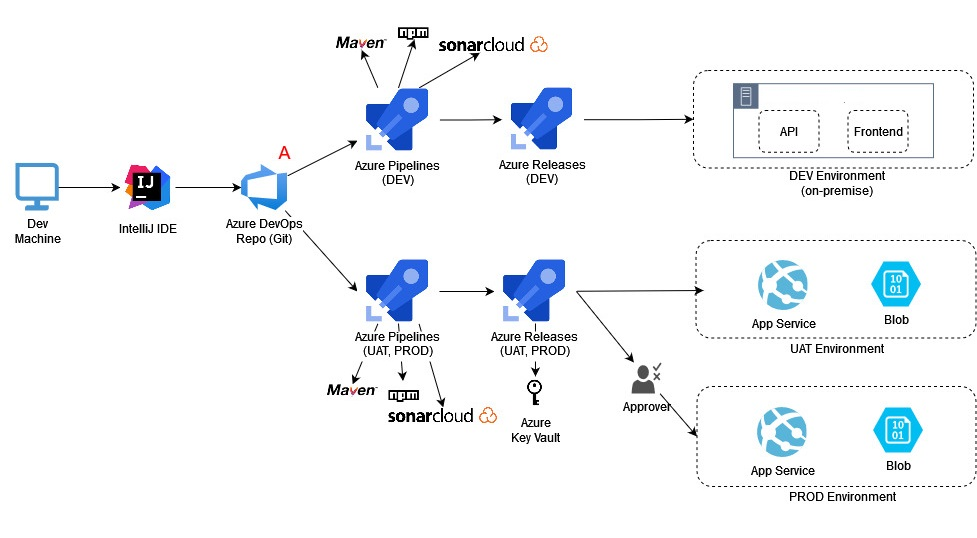

# ionic-app-hosted-in-azure

*******
Tables of contents  
 1. [Project Architecture](#projectArchitecture )
 2. [Set up Pipeline](#SetupPipeline)

*******

### 1. Project Architecture

a. Diagram
 

b. Data flow
	
1. User submit request approval
2. Ets.api call Power Automate to send Teams notification in the flow
3. User visit ETS mobile app via link from Teams
4. User go to AAD login page to sign in with username & password (implicit flow & access token lifetime around 60-75 mins) with browser. Once authenticated, AAD Server return access token
5. Angular app send request to java middleware to get results  
6. Backend app service validate access token by audience & scope & use email decoding from token as a parameter
7. If token is valid, users can view the results

c. Use OAuth 2.0 implicit grant flow

d. Azure Cost Estimate
 

  

### 2. Set up Pipeline

a. Pipeline Diagram
 

b. Data flow

<ol>
<li>Developers change application source code</li>
<li>Application code including the configuration file is committed to the source code repository in Azure Repos.</li>
<li>Continuous integration (DEV) triggers unit tests, security scanning & application build.</li>
<li>Continuous deployment within Azure Pipelines triggers an deployment application artifacts for DEV environment manually.</li>
<li>The artifact with DEV configurations (War file) is deployed to Azure App Service & Blob Storage.</li>
<li>Continuous integration (UAT / PROD) triggers unit tests & application build.</li>
<li>Continuous deployment within Azure Pipelines triggers an deployment application artifacts for UAT / PROD environment manually.</li>
<li>The artifact with UAT Configurations (Jar file) is deployed to Azure App Service & Blob Storage</li>
<li>The deployment seeks approval before proceed.</li>
<li>When approved, the deployment with configuration injected from key vault (Jar file) is deployed to Azure App Service & Blob Storage</li>
</ol>
